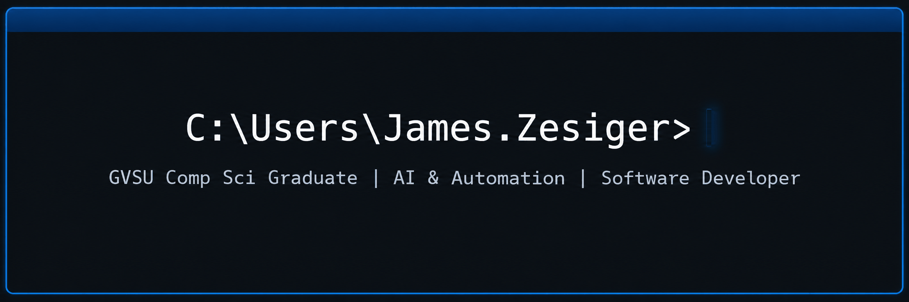

# ✨ About Me ✨

💻 <b>Pasionate Software and Web developer</b>  
🌐 Experienced in <b>C#</b> programming with <b>.NET</b> framework  
🤖 Pushing the boundary in <b>AI powered development</b> and <b>implementation</b>   
📖 Advocate for Open Source and data ownership  
🎓 GVSU <b>Computer Science</b> Graduate  
🐈 <b>Father</b> of 2 <element style="font-size: 10px;">(cats)</element>🐈‍⬛  

 
# 🏢 Experience 🏢

🤖 <b>AI Implementation Developer</b> at <b>CU*Answers</b> — Implement AI tools and systems into products and workflows  
🚗 <b>Software Development Intern</b> at <b>DENSO</b> Battle Creek — Partial refactoring to update automated guided robots  
🛟 <b>Lifeguard</b>  

# 🛠️ Current Projects 🛠️

🌐[py] <b>HomeNet</b> — Personal home network running in docker containers serving Immich, PiHole, AudiobookShelf, custom dashboard and StreamDeck 
📺[py] <b>StreamDeck</b> — Centralized collection of streaming services with movie/show lookup and deeplink to service.  

